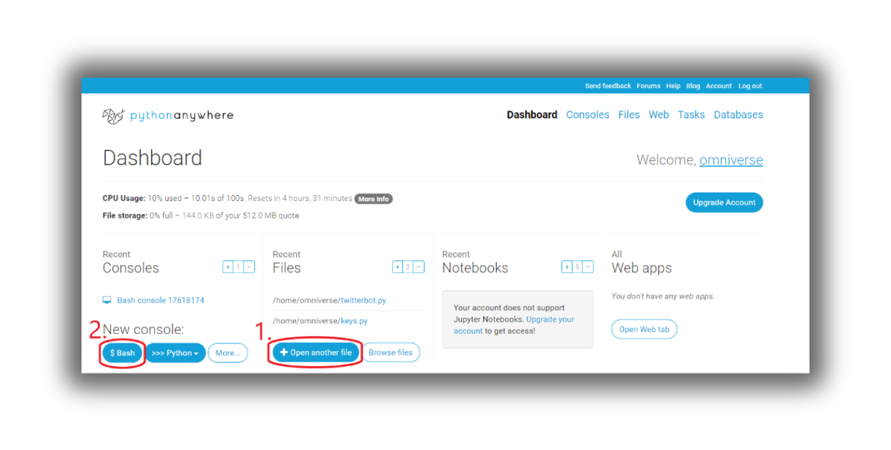

# Twitter Bot - omniverse_bot
[](https://travis-ci.org/joemccann/dillinger)

This Twitter Bot is a cloud Server Deployed and 24/7, tweet india trends like 
whats people been talking about.


## Technology Used
  - Python 3 (Coding language to write code for your Bot) 
  - [Tweepy](http://docs.tweepy.org/en/latest/getting_started.html) (python Module for managing/automating tweeter account)
  - [pythonanywhere](https://www.pythonanywhere.com/) (A online integrated development environment and web hosting service based on the Python programming language.)



For running your bot 24/7 live you can sign up on [Pythonanywhere](https://www.pythonanywhere.com/)
And upload your code and keys into server 
and Run this Simple Command in your Bash terminal 

```sh
$ python yourbotscript.py
```

# Features!

  - Like the tweets according to condition written in code.
  - Retweet tweet aautomatically (currently retweeting trending tweets in indian Users)

You can also:
  - Make this bot to like, comment and retweet a specific user.
  - With automated 100 tweet bot you can create your bot small agency which will do whatever you want them to do.
  - You can Bomb likes or use them for Giveaways and other sort of things.
  - Or you can handle bots just by changing your Bio status with coditional programming and it wil read case queries from your profile

### Got some idea what Bots can do ?

> When Henry Ford made cheap, reliable cars, people said, 
> ‘Nah, what’s wrong with a horse?’ That was a huge bet he made, 
> and it worked.

> **Elon Musk**
> CEO of SpaceX.

## Requirement & Installation
- First create Twitter Developer Account from [here](https://developer.twitter.com/en/apply-for-access)
- Get the token and all other keys from tweeter developer account and save them in ```keys.py```
- Now [install Python from here](https://www.python.org/downloads/) if you first want to run your scripts in local machine.
- Install [Tweepy](http://docs.tweepy.org/en/latest/install.html) 
The easiest way to install the latest version from PyPI is by using pip:
```sh
$ pip install tweepy
```
You can also use Git to clone the repository from GitHub to install the latest development version:
```sh
git clone https://github.com/tweepy/tweepy.git
cd tweepy
pip install .
```
Alternatively, install directly from the GitHub repository:
```sh
pip install git+https://github.com/tweepy/tweepy.git
```
- get the codes from [```twitter bot1.ipynb```](https://github.com/mmaithani/Omniverse-Bot/blob/main/twitter_bot1.ipynb) file  

# Testing code 
```sh
consumer_key = "place your consumer key here which you got from twitter deveoloper account "
consumer_secret = "#"
access_token = "#"
access_token_secret = "#"

import tweepy
auth = tweepy.OAuthHandler(consumer_key, consumer_secret)
auth.set_access_token(access_token, access_token_secret)

api = tweepy.API(auth)

public_tweets = api.home_timeline()
for tweet in public_tweets:
    print(tweet.text) #this will print your recent tweets form twitter account
```

### Development

Want to contribute? Great!
Open your favorite Terminal and run these commands.

First Tab:
```sh
$ git clone https://github.com/mmaithani/Omniverse-Bot.git
```
Create the branch on your local machine and switch in this branch :
```sh
$ git checkout -b [name_of_your_new_branch]
```
Edit files, add and commit. Then[ push with the](https://git-scm.com/docs/git-push) -u (short for --set-upstream) option:
```sh
$ git push -u origin <branch>
```
Git will set up the tracking information during the push.

License
----
[WTFPL](https://en.wikipedia.org/wiki/WTFPL#:~:text=WTFPL%20is%20a%20GPL%2Dcompatible,dedication%20to%20the%20public%20domain.&text=The%20title%20is%20an%20abbreviation,You%20Want%20To%20Public%20License%22.) Do What the Fuck You Want To Public License 


